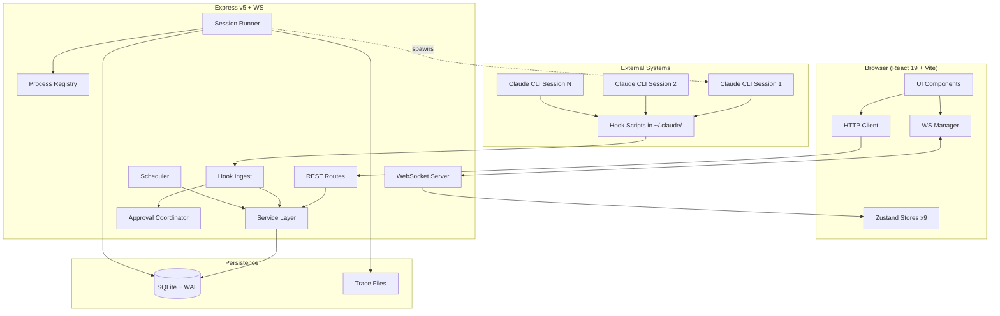
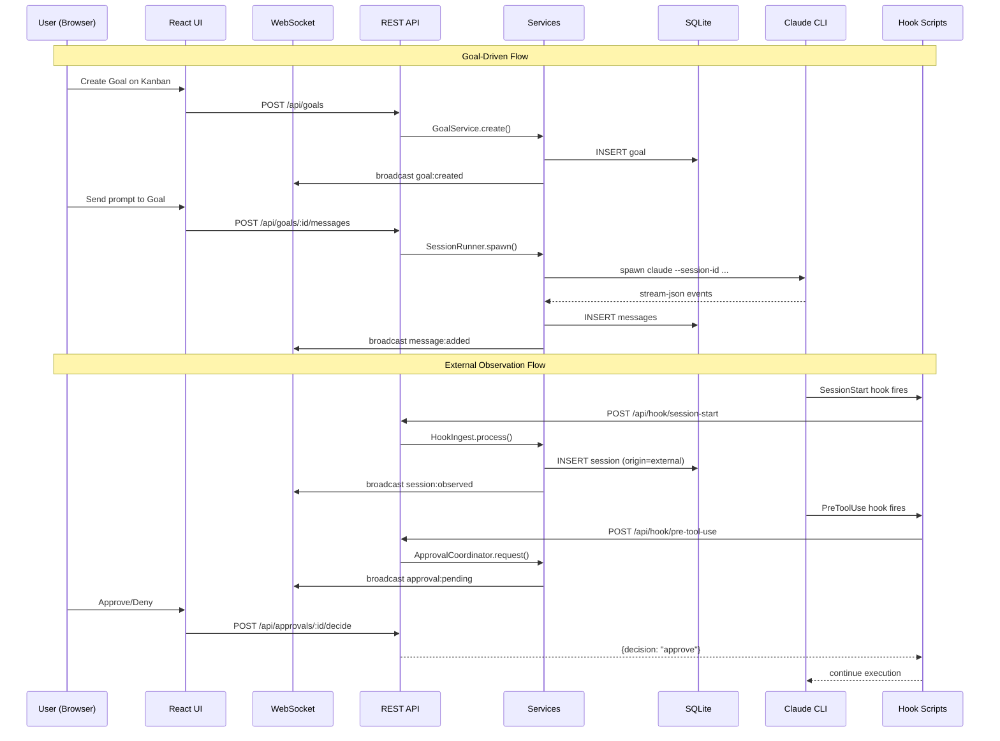
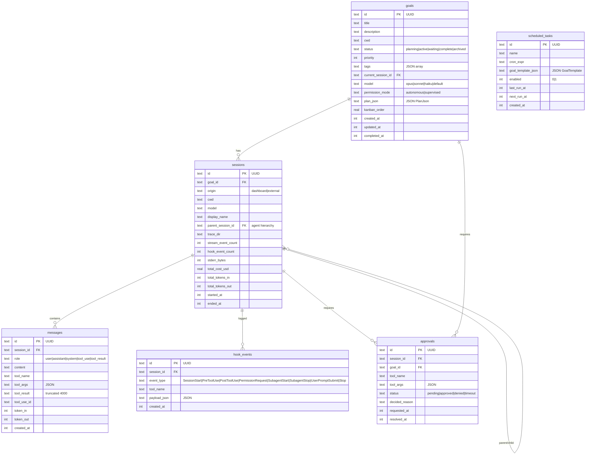
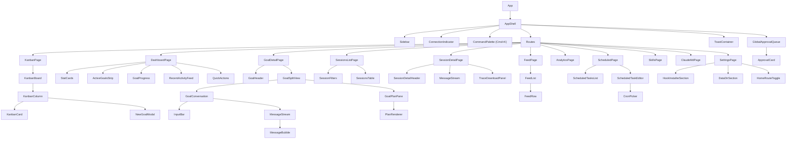

# Claude Deck — Project Documentation

Multi-session web dashboard for monitoring and orchestrating Claude Code CLI sessions.

**Repo**: `Koenarvs/claude-deck`
**Version**: 0.1.0 (active development)
**Created**: 2026-04-20 (single-day build sprint, ~10-12h)

## Project Goal

Provide a unified control plane for Claude Code power users who run multiple concurrent CLI sessions. Claude Deck observes external sessions via hooks, manages goal-driven workflows through a Kanban board, and gives visibility into cost, token usage, and tool activity across all sessions.

## Tech Stack

| Layer | Technology |
|-------|-----------|
| Frontend | React 19, Vite 6, Tailwind CSS v4, Zustand v5, React Router v7, Recharts v2, Lucide, react-window, @dnd-kit, react-markdown |
| Backend | Express v5, better-sqlite3 v12, ws v8, node-cron v4, Zod v3, Pino v10 |
| Build | TypeScript 5.5 (strict), Vitest v3, Prettier v3, Concurrently v9 |
| Deploy | Docker (Alpine Node 22), PM2 |

## Architecture



## Data Flow



## Database Schema



## Feature Inventory

### Complete (UI + Backend + DB fully wired)

| # | Feature | Description |
|---|---------|-------------|
| 1 | **Goals / Kanban Board** | Create, update, archive goals. Drag-and-drop columns (planning/active/waiting/complete). Tags, priority, permission mode. Real-time WS updates. |
| 2 | **Goal Detail View** | Resizable split-view: conversation (left) + tabbed plan pane (right, collapsible). Message history, tool approval inline, session cost/token display. |
| 3 | **Tabbed Document Pane** | Plan tab (PlanJson from TodoWrite), Research, Notes, To-Do tabs with markdown rendering. |
| 4 | **Approval Queue** | Global floating approval stack (top-right). Approve/deny buttons, browser notifications, tab badge, 30min timeout. Handles PreToolUse + PermissionRequest blocking. |
| 5 | **Session Management** | List all sessions (dashboard + external origin). Filter, paginate. Per-session message browsing. Trace download (individual + tar.gz bundle). |
| 6 | **Hook Layer** | 8 hook event types ingested: SessionStart, PreToolUse, PostToolUse, PermissionRequest, SubagentStart/Stop, UserPromptSubmit, Stop. Creates external sessions, extracts plans from TodoWrite, manages approval gates. |
| 7 | **Analytics Dashboard** | Tool usage by category, daily costs (line), activity heatmap (calendar), sessions/day, duration distribution, totals. Time range filter (7d/30d/90d/all). |
| 8 | **Scheduled Tasks** | CRUD with cron expressions. Goal template system. Enable/disable, run-now. Cron validation. node-cron runtime scheduling. |
| 9 | **SessionRunner** | Spawns Claude CLI subprocess. stream-json parsing. Message persistence. Interrupt, resume. Process registry (one-per-goal). Graceful shutdown. |
| 10 | **Hook Installer** | Install/uninstall hooks into ~/.claude/settings.json. Backup original. Marker-based status check. Multi-OS paths. |
| 11 | **Database** | SQLite WAL mode, foreign keys, 4 versioned migrations, proper indexes. |
| 12 | **WebSocket Sync** | Auto-reconnect with exponential backoff. Subscription model (all or specific goals). Event dispatch to Zustand stores. Goal-scoped filtering. |
| 13 | **Context Health** | Token usage, cost, turns, context window percentage bar per session. |

### Partial (some pieces missing)

| # | Feature | What Works | What's Missing |
|---|---------|-----------|---------------|
| 14 | **Skills Browser** | Scans ~/.claude/skills, agents, hooks, commands | Search/filtering, detailed skill pages, custom dir scanning refinement |
| 15 | **Settings Page** | Hook installer UI, data dir display | Export/import settings, advanced config |
| 16 | **Message Streaming** | DB persistence, WS broadcast | Live streaming to UI (messages fetch on demand, not piped real-time) |
| 17 | **Trace Files** | Trace dir creation, download endpoints | Retention policies, automated cleanup (trace-pruner.ts exists but not wired) |
| 18 | **Agent Hierarchy** | Schema (parent_session_id, display_name), SubagentStart/Stop events | UI for tree view, visual hierarchy graph, unified trace bundle |

### Stubbed / Not Started

| # | Feature | Current State |
|---|---------|--------------|
| 19 | **CLAUDE.md Viewer** | Page skeleton exists, file fetch minimal |
| 20 | **MCP Integration** | Separate /mcp subproject with basic structure, not integrated |
| 21 | **Agent Teams UI** | Schema ready, no coordination/visualization UI |

## API Reference

### Goals
| Method | Path | Description |
|--------|------|-------------|
| POST | `/api/goals` | Create goal |
| GET | `/api/goals` | List goals (filter: status, tag) |
| GET | `/api/goals/:id` | Goal detail (+ messages + plan) |
| PATCH | `/api/goals/:id` | Update goal |
| DELETE | `/api/goals/:id` | Archive goal |
| POST | `/api/goals/:id/messages` | Send prompt (spawn/resume session) |
| POST | `/api/goals/:id/interrupt` | Interrupt active session |
| POST | `/api/goals/:id/adopt-session` | Link external session to goal |

### Sessions
| Method | Path | Description |
|--------|------|-------------|
| GET | `/api/sessions` | List sessions (filter: origin, active, goal_id) |
| GET | `/api/sessions/:id` | Session detail |
| GET | `/api/sessions/:id/messages` | Messages (cursor pagination) |

### Approvals
| Method | Path | Description |
|--------|------|-------------|
| GET | `/api/approvals` | List approvals (filter: status) |
| POST | `/api/approvals/:id/decide` | Resolve approval |

### Hooks (Ingest)
| Method | Path | Description |
|--------|------|-------------|
| POST | `/api/hook/session-start` | Create external session |
| POST | `/api/hook/user-prompt-submit` | Log user prompt |
| POST | `/api/hook/pre-tool-use` | Approval gate (blocks) |
| POST | `/api/hook/post-tool-use` | Tool result + plan extraction |
| POST | `/api/hook/permission-request` | 3-way permission gate (blocks) |
| POST | `/api/hook/subagent-start` | Link child session |
| POST | `/api/hook/subagent-stop` | Mark child ended |
| POST | `/api/hook/stop` | Mark session ended |

### Scheduled Tasks
| Method | Path | Description |
|--------|------|-------------|
| GET | `/api/scheduled-tasks` | List all |
| POST | `/api/scheduled-tasks` | Create |
| PATCH | `/api/scheduled-tasks/:id` | Update |
| DELETE | `/api/scheduled-tasks/:id` | Delete |
| POST | `/api/scheduled-tasks/:id/run-now` | Fire immediately |

### Traces
| Method | Path | Description |
|--------|------|-------------|
| GET | `/api/sessions/:id/trace/stream` | stream.jsonl |
| GET | `/api/sessions/:id/trace/hooks` | hooks.jsonl |
| GET | `/api/sessions/:id/trace/stderr` | stderr.log |
| GET | `/api/sessions/:id/trace/meta` | meta.json |
| GET | `/api/sessions/:id/trace/bundle` | tar.gz bundle |
| GET | `/api/goals/:id/trace` | All traces for goal |

### System
| Method | Path | Description |
|--------|------|-------------|
| GET | `/api/health` | Server health |
| GET | `/api/skills` | Scan Claude Code skills |
| GET | `/api/extensions` | MCP servers + plugins |
| GET | `/api/analytics/tool-usage` | Tool usage stats |
| GET | `/api/analytics/daily-costs` | Daily cost breakdown |
| GET | `/api/analytics/activity-heatmap` | Session heatmap |
| GET | `/api/analytics/sessions-per-day` | Daily session counts |
| GET | `/api/analytics/session-durations` | Duration distribution |
| GET | `/api/analytics/totals` | Aggregate totals |

## WebSocket Events

### Client to Server
| Type | Description |
|------|-------------|
| `subscribe` | Subscribe to `"all"` or specific goal IDs |
| `unsubscribe` | Stop receiving events |
| `ping` | Heartbeat |

### Server to Client
| Type | Description |
|------|-------------|
| `goal:created` | New goal |
| `goal:updated` | Goal updated |
| `goal:status` | Status change |
| `goal:plan-updated` | Plan from TodoWrite |
| `message:added` | Message added |
| `session:observed` | External session detected |
| `session:ended` | Session ended |
| `approval:pending` | Approval required |
| `approval:resolved` | Approval decided |
| `hook:event` | Raw hook event |
| `subprocess:error` | Spawn error |

## Component Tree



## Zustand Stores

| Store | Purpose |
|-------|---------|
| `useGoalsStore` | Goals CRUD + caching |
| `useSessionsStore` | Sessions CRUD + caching |
| `useMessagesStore` | Per-goal messages |
| `usePlanStore` | Per-goal plans (from TodoWrite) |
| `useApprovalsStore` | Pending/resolved approvals |
| `useFeedStore` | Hook events feed |
| `useConnectionStore` | WS connection status |
| `useConfigStore` | Global UI config |
| `useSessionHealthStore` | Session cost/token tracking |

## Future Features (Not Yet Started)

| Feature | Description | Priority |
|---------|-------------|----------|
| Agent hierarchy tree view | Visual parent/child session nesting in Sessions tab | High |
| Agent hierarchy graph | Visual hierarchy in right pane Agents tab | High |
| Unified trace bundle | Chronological merge of parent + child streams | Medium |
| Live message streaming | Pipe messages to UI as they arrive (not fetch-on-demand) | High |
| Trace retention/cleanup | Wire trace-pruner.ts, configurable retention | Medium |
| CLAUDE.md editor | Full viewer with file discovery and syntax highlighting | Low |
| MCP resource browser | Read/list MCP resources from dashboard | Low |
| Agent team workflows | Coordinate parallel agent sessions with shared goals | Future |
| Config export/import | Settings portability | Low |
| Multi-user support | Multiple users sharing a Claude Deck instance | Future |

## Development

```bash
npm install          # Install dependencies
npm run dev          # Vite (5173) + Express (4100) concurrently
npm run build        # Production build
npm run start        # Run production server
npm test             # 715+ tests (Vitest)
npm run typecheck    # TypeScript strict check
npm run format       # Prettier
```

## Environment

| Variable | Default | Description |
|----------|---------|-------------|
| `PORT` | 4100 | Server port |
| `DATA_DIR` | ./data | SQLite DB + trace files |
| `LOG_LEVEL` | info | Pino log level |

## Test Coverage

715+ tests across:
- `tests/server/routes/` — Route unit tests
- `tests/server/services/` — Service unit tests
- `tests/server/db/` — Migration tests
- `tests/server/` — Coordinator, ingest, registry, scheduler
- `tests/shared/` — Domain types and schemas
- `tests/scripts/` — Hook installer
- `tests/client/` — Frontend tests
