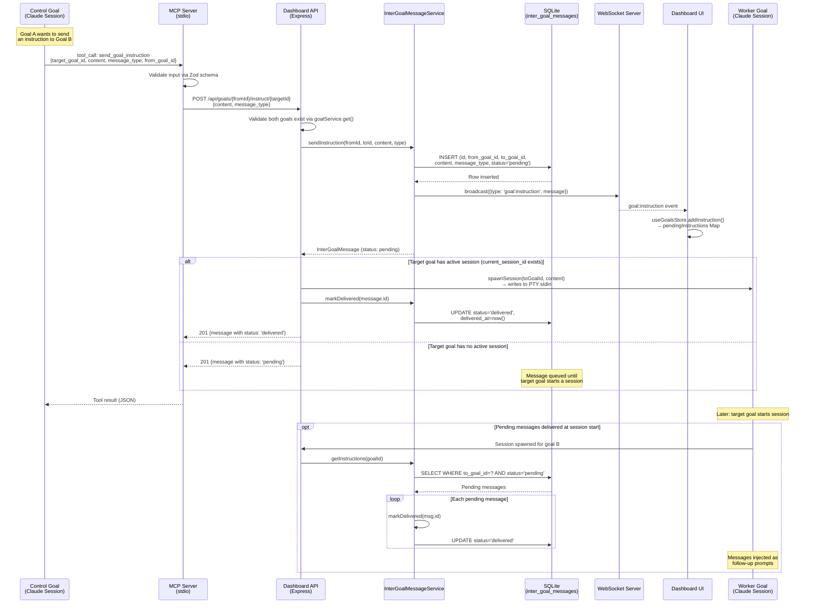
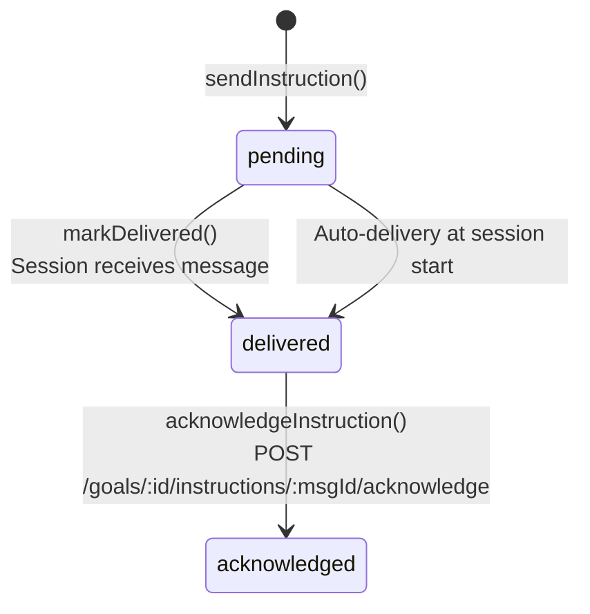
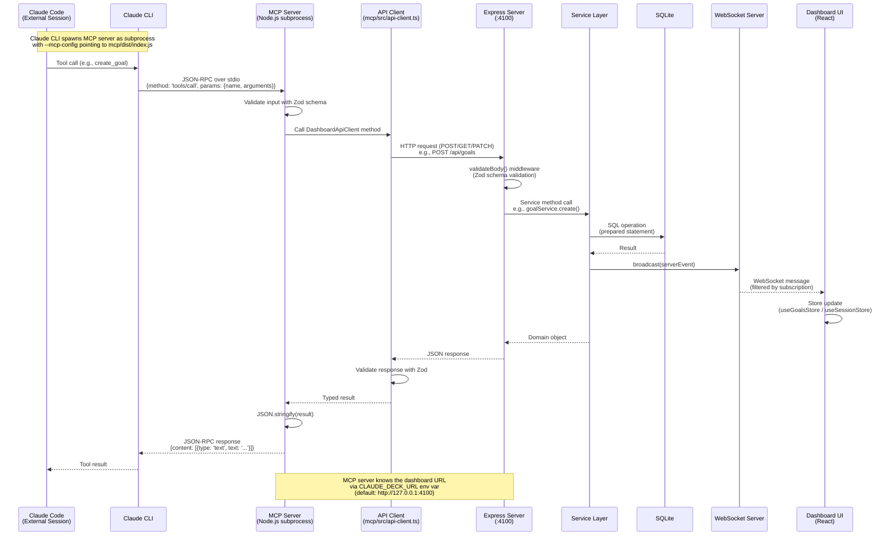
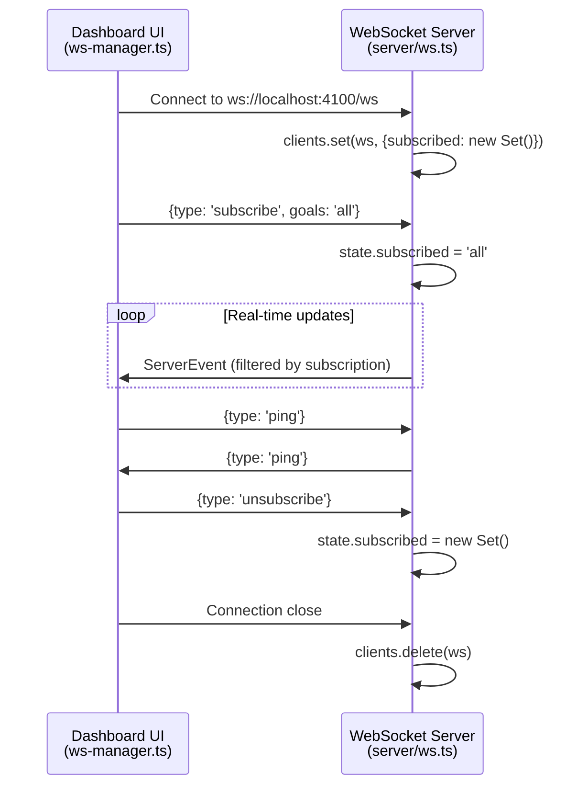
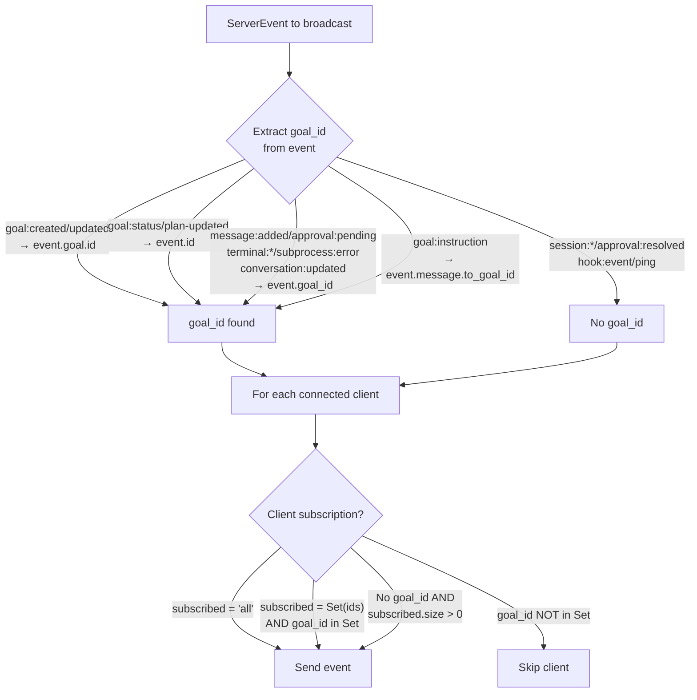
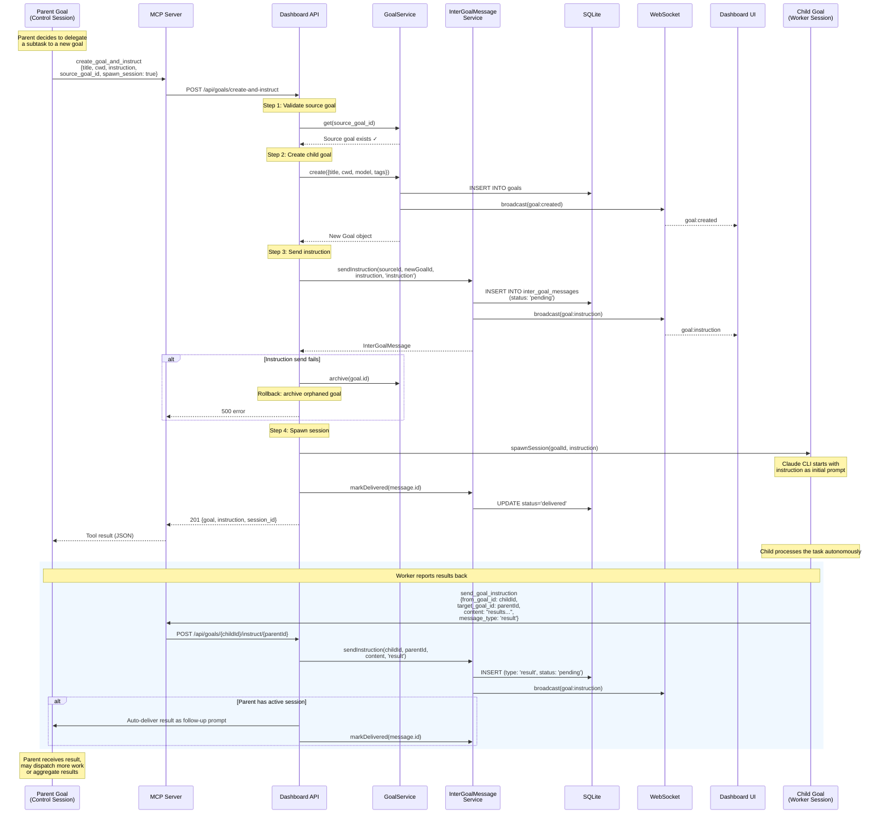
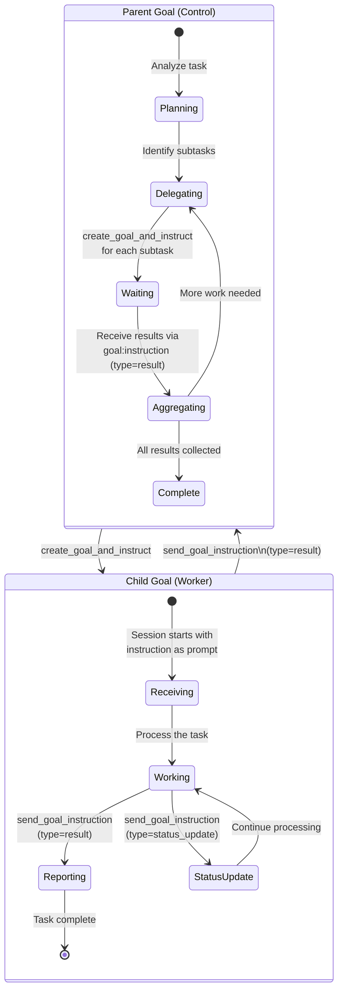
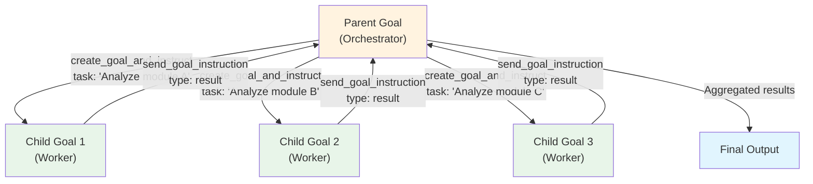

# Communication & Orchestration Flows

This document details the communication patterns in Claude Deck: how goals talk to each other, how external Claude Code sessions invoke MCP tools, how the WebSocket layer propagates real-time updates, and how multi-agent orchestration works end-to-end.

---

## 1. Inter-Goal Communication Flow

Goals communicate asynchronously via the `send_goal_instruction` MCP tool. Messages are persisted in the `inter_goal_messages` SQLite table with a lifecycle of `pending → delivered → acknowledged`. If the target goal has an active session, the message is auto-delivered as a follow-up prompt; otherwise it queues until the goal's next session starts.



### Message Types

| Type | Purpose | Direction |
|------|---------|-----------|
| `instruction` | Delegate work or send a command | Control → Worker |
| `result` | Return completed work or data | Worker → Control |
| `status_update` | Report progress or state changes | Either direction |
| `context` | Share background information | Either direction |

### Message Status Lifecycle



---

## 2. MCP Tool Request Flow

External Claude Code sessions interact with Claude Deck through an MCP server that runs as a child process. The MCP server communicates via stdio transport with Claude CLI, and proxies all operations to the Dashboard HTTP API. This ensures every mutation flows through the same validation and WebSocket broadcast path as the UI.



### MCP Server Architecture

The MCP server (`mcp/src/index.ts`) registers 10 tools that map 1:1 to Dashboard API endpoints:

| MCP Tool | HTTP Method | API Endpoint | Purpose |
|----------|-------------|--------------|---------|
| `list_goals` | GET | `/api/goals` | List goals with optional filters |
| `get_goal` | GET | `/api/goals/:id` | Get goal detail with messages/plan |
| `create_goal` | POST | `/api/goals` | Create goal, optionally spawn session |
| `update_goal` | PATCH | `/api/goals/:id` | Update goal fields |
| `send_message` | POST | `/api/goals/:id/messages` | Send prompt to active session |
| `list_sessions` | GET | `/api/sessions` | List sessions with filters |
| `get_session_messages` | GET | `/api/sessions/:id/messages` | Get session message history |
| `schedule_task` | POST | `/api/scheduled-tasks` | Create cron-based goal template |
| `send_goal_instruction` | POST | `/api/goals/:id/instruct/:targetId` | Inter-goal messaging |
| `create_goal_and_instruct` | POST | `/api/goals/create-and-instruct` | Atomic create + instruct + spawn |

### Error Handling Chain

```mermaid
flowchart LR
    A[Tool Handler] -->|throws| B{Error Type}
    B -->|ApiConnectionError| C["Dashboard unreachable.<br/>Is claude-deck running?"]
    B -->|ApiError| D["HTTP status + body<br/>(e.g., 404 Goal not found)"]
    B -->|Error| E[error.message]
    B -->|unknown| F[String(err)]
    C --> G["MCP response<br/>{isError: true, content: [...]}"]
    D --> G
    E --> G
    F --> G
```

---

## 3. send_message vs send_goal_instruction

These are the two communication mechanisms for interacting with goals. They serve different purposes and have different semantics.

```mermaid
flowchart TB
    subgraph send_message["send_message"]
        SM1[Input: goal_id + prompt] --> SM2[POST /api/goals/:id/messages]
        SM2 --> SM3{Goal has<br/>active PTY?}
        SM3 -->|Yes| SM4[Write prompt to<br/>PTY stdin as follow-up]
        SM3 -->|No| SM5[Spawn new PTY session<br/>with prompt as initial input]
        SM4 --> SM6[Return session_id]
        SM5 --> SM6
    end

    subgraph send_goal_instruction["send_goal_instruction"]
        SGI1["Input: from_goal_id + target_goal_id<br/>+ content + message_type"] --> SGI2["POST /api/goals/:fromId/instruct/:targetId"]
        SGI2 --> SGI3[Create inter_goal_messages<br/>row with status=pending]
        SGI3 --> SGI4[Broadcast goal:instruction<br/>WebSocket event]
        SGI4 --> SGI5{Target has<br/>active session?}
        SGI5 -->|Yes| SGI6[Auto-deliver: spawnSession<br/>+ markDelivered]
        SGI5 -->|No| SGI7[Message queued as<br/>pending in DB]
        SGI6 --> SGI8[Return message<br/>status=delivered]
        SGI7 --> SGI8B[Return message<br/>status=pending]
    end

    style send_message fill:#e1f5fe
    style send_goal_instruction fill:#f3e5f5
```



### Comparison Table

| Aspect | `send_message` | `send_goal_instruction` |
|--------|----------------|-------------------------|
| **Purpose** | User/UI sends prompt to a goal | Goal-to-goal orchestration |
| **Sender identity** | None (implicit: user/UI) | Explicit `from_goal_id` required |
| **Persistence** | No message record created | Persistent `inter_goal_messages` row |
| **Message types** | N/A (always a prompt) | `instruction`, `result`, `status_update`, `context` |
| **Queuing** | No — spawns session immediately | Yes — queues if no active session |
| **Status tracking** | None | `pending → delivered → acknowledged` |
| **WebSocket events** | None specific | `goal:instruction` broadcast |
| **Use case** | Dashboard UI "Send" button, direct interaction | Multi-agent delegation and result reporting |
| **API endpoint** | `POST /goals/:id/messages` | `POST /goals/:fromId/instruct/:targetId` |

### When to Use Each

- **`send_message`**: When a user (via the dashboard UI) or an external agent wants to start or continue a conversation with a specific goal. It always results in an active session.

- **`send_goal_instruction`**: When one goal needs to delegate work to another goal, report results back, or share context. Messages persist and queue, enabling asynchronous orchestration patterns where goals may not be running simultaneously.

---

## 4. WebSocket Event Flow

The WebSocket server (`server/ws.ts`) provides real-time event propagation from the server to all connected dashboard clients. Clients subscribe to specific goal IDs or to `'all'` events. The server filters outgoing events based on these subscriptions.

### Connection Lifecycle



### Event Routing Logic



### All WebSocket Message Types

#### Server → Client Events

| Event Type | Key Payload Fields | Triggered By |
|------------|-------------------|--------------|
| `goal:created` | `goal` (full Goal object) | `goalService.create()` |
| `goal:updated` | `goal` (full Goal object) | `goalService.update()` |
| `goal:status` | `id`, `status`, `current_session_id` | Session start/end transitions |
| `goal:plan-updated` | `id`, `plan_json` | Plan file parsing |
| `message:added` | `goal_id`, `session_id`, `message` | `messageService.save()` |
| `approval:pending` | `approval`, `goal_id` | Permission request from CLI |
| `approval:resolved` | `id`, `decision` | User approves/denies in UI |
| `session:observed` | `session` (full Session object) | `sessionService.create()` |
| `session:ended` | `id` | Session runner exit |
| `hook:event` | `event` (HookEvent object) | Hook ingestion pipeline |
| `subprocess:error` | `goal_id`, `error` | CLI exits with non-zero code |
| `terminal:data` | `goal_id`, `data` | PTY stdout/stderr output |
| `terminal:started` | `goal_id` | PTY process spawned |
| `terminal:exited` | `goal_id`, `exitCode` | PTY process exits |
| `goal:instruction` | `message` (InterGoalMessage) | `interGoalMessageService.sendInstruction()` |
| `conversation:updated` | `goal_id` | Conversation markdown rebuilt |
| `ping` | (empty) | Client ping echo |

#### Client → Server Messages

| Message Type | Key Payload Fields | Purpose |
|--------------|--------------------|---------|
| `subscribe` | `goals: string[] \| 'all'` | Register interest in goal events |
| `unsubscribe` | (none) | Clear all subscriptions |
| `ping` | (none) | Keepalive check |
| `terminal:input` | `goal_id`, `data` | Send keystrokes to PTY |
| `terminal:resize` | `goal_id`, `cols`, `rows` | Resize PTY dimensions |

---

## 5. Multi-Agent Orchestration Pattern

The `create_goal_and_instruct` tool enables a parent goal to atomically create a child goal, send it an instruction, and spawn a session — all in one operation. This is the foundation for multi-agent orchestration where a control goal dispatches work to specialized worker goals.

### Atomic Delegation Flow



### Orchestration Lifecycle



### Fan-Out / Fan-In Pattern

A common orchestration pattern: the parent goal fans out work to multiple child goals, then fans in the results.



### Failure Handling

The `create_goal_and_instruct` endpoint implements a rollback strategy for partial failures:

| Step | Failure Mode | Recovery |
|------|-------------|----------|
| Validate source goal | Source goal not found | Return 404, no state change |
| Create child goal | DB error | Return 500, no state change |
| Send instruction | DB error or broadcast failure | Archive orphaned goal, return 500 |
| Spawn session | PTY/CLI error | Log warning; goal + instruction still exist (can retry manually) |

The operation is not fully transactional — step 4 (session spawn) is best-effort. If it fails, the goal and instruction are preserved so the user can manually start the session later.
