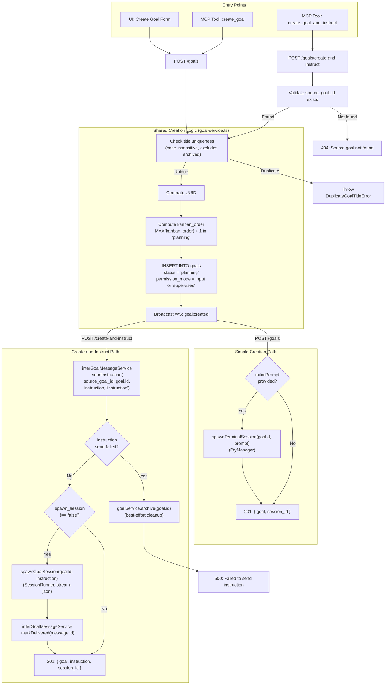
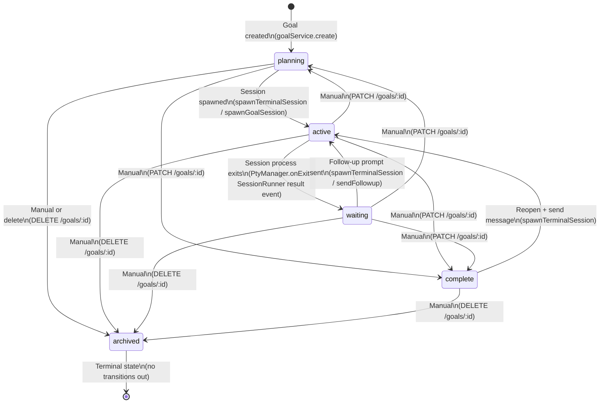
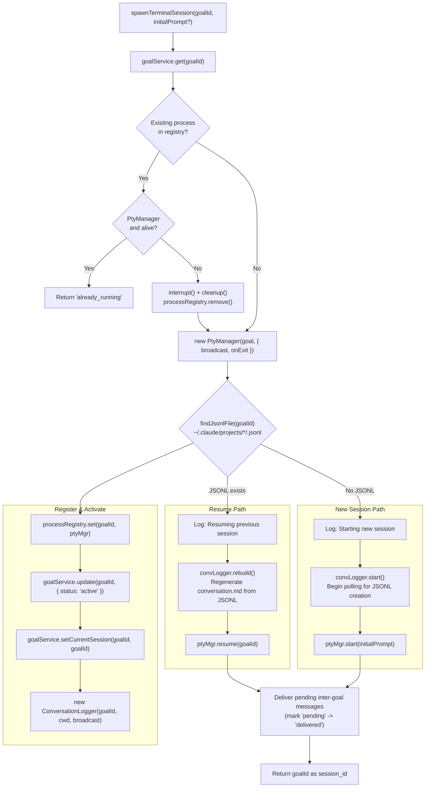
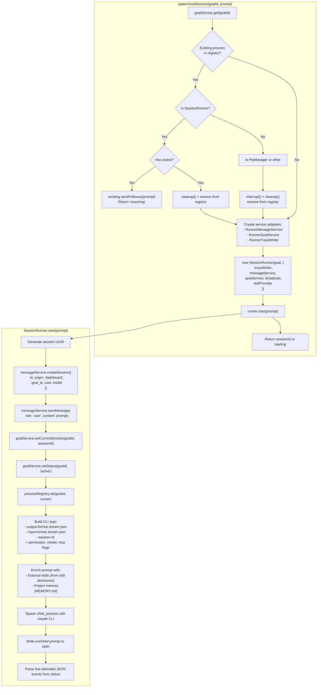
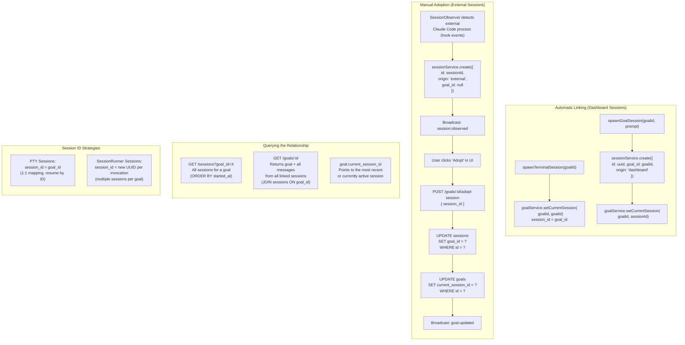
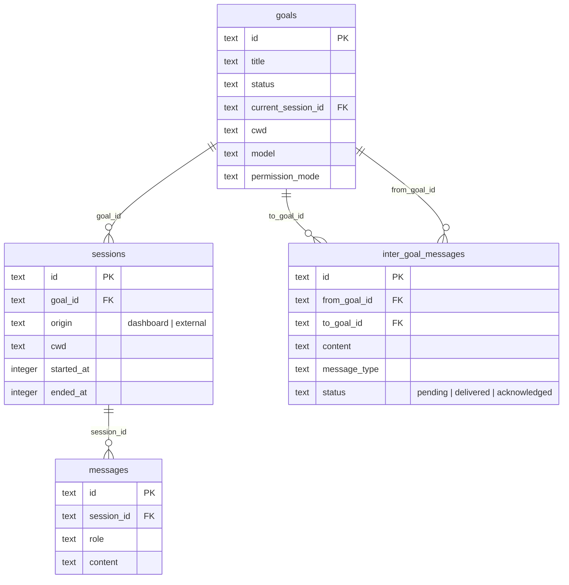
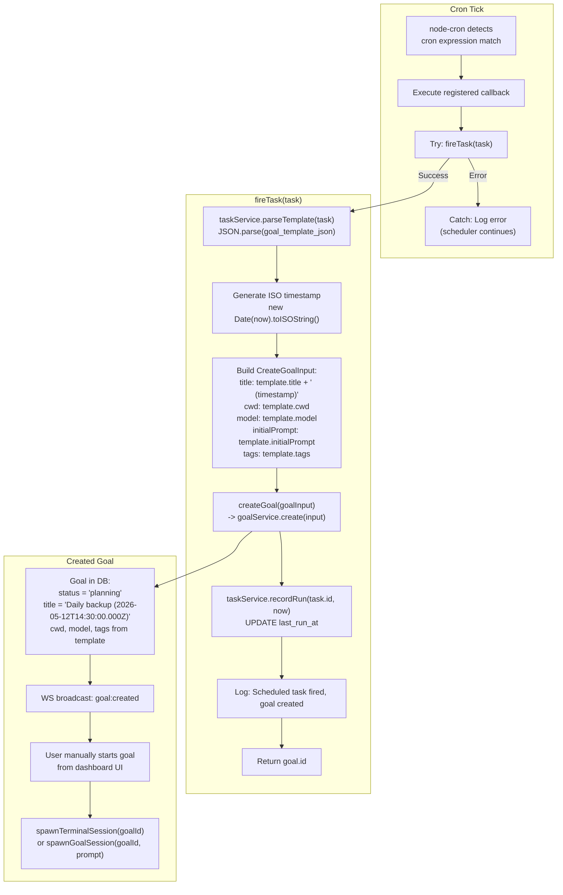
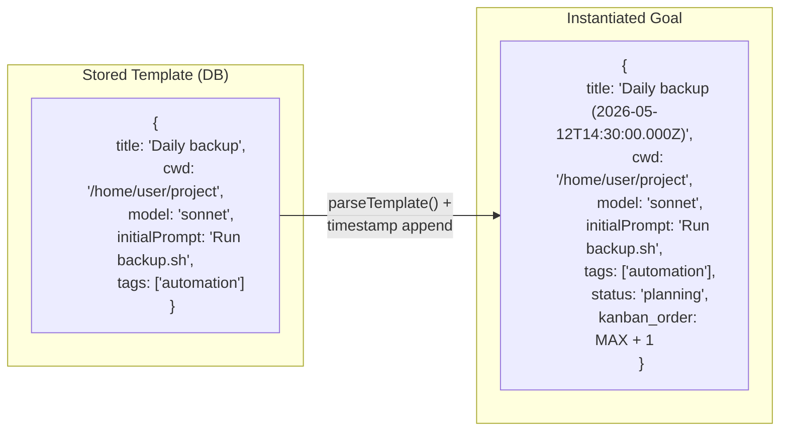

# Goal Lifecycle Flows

This document describes the core lifecycle processes in Claude Deck: how goals are created, how they transition between states, how sessions are spawned and linked, and how scheduled tasks instantiate goals on a cron schedule.

All diagrams are based on the server-side implementation in `server/`.

---

## 1. Goal Creation Flow

Goals can be created through two paths: simple creation via `POST /goals` (used by the UI and the `create_goal` MCP tool), and atomic create-and-instruct via `POST /goals/create-and-instruct` (used by the `create_goal_and_instruct` MCP tool for goal orchestration). Both paths share the same core creation logic in `goal-service.ts` but differ in what happens after the goal row is inserted.

Simple creation optionally spawns a PTY terminal session when an `initialPrompt` is provided. Create-and-instruct always sends an inter-goal message and optionally spawns a SessionRunner (stream-json mode) to process the instruction.

**Key differences between the two paths:**

| Aspect | `create_goal` | `create_goal_and_instruct` |
|--------|---------------|----------------------------|
| Session type | PtyManager (terminal) | SessionRunner (stream-json) |
| Inter-goal message | None | Always created |
| Source goal required | No | Yes (`source_goal_id`) |
| Rollback on failure | None (goal persists) | Archives goal if instruction fails |
| Session spawn | Only if `initialPrompt` set | Default true (`spawn_session`) |

---

## 2. Goal State Machine

Goals progress through five statuses. The state machine is defined in `server/state-machine/goal-status.ts`. The `archived` status is terminal -- no transitions out of it are permitted. Most transitions are triggered by session lifecycle events (spawn, exit, follow-up), though manual transitions via the API are also supported.

### Transition trigger details

| From | To | Triggered By | Code Location |
|------|----|-------------|---------------|
| `planning` | `active` | `spawnTerminalSession()` or `spawnGoalSession()` sets `status: 'active'` | `index.ts:239`, `session-runner.ts:189-190` |
| `active` | `waiting` | PTY exit callback or SessionRunner `result` event | `index.ts:228`, `session-runner.ts:634` |
| `waiting` | `active` | User sends follow-up message, re-spawning the session | `index.ts:239` |
| `complete` | `active` | User reopens goal and sends a message | `index.ts:239` |
| any | `complete` | User manually marks goal complete via PATCH | `goal-service.ts:316-319` (sets `completed_at`) |
| any (except archived) | `archived` | DELETE endpoint or manual status update | `goal-service.ts:382-408` (sets `completed_at`) |

---

## 3. Session Spawn Flow

When a goal session is started, the system decides between spawning a new session or resuming an existing one. This decision is based on whether a Claude Code JSONL transcript file exists for the goal ID. The PtyManager wraps `node-pty` to create a pseudo-terminal running the `claude` CLI with appropriate flags.

### 3a. PTY Session Spawn (Terminal Mode)

Used by: `POST /goals/:id/messages` (terminal endpoint), `POST /goals` (with `initialPrompt`).

### 3b. PtyManager Internal Spawn

The PtyManager resolves the `claude` CLI path, builds the argument list with session management and MCP flags, and spawns a PTY process via `node-pty`. On Windows, a workaround is applied because Git Bash sets `process.execPath` to a stub path that `node-pty`'s conpty agent cannot use.

```mermaid
flowchart TD
    subgraph "PtyManager.start(initialPrompt?)"
        RESOLVE["resolveClaudePath()\nResolve 'claude' binary location"]
        BUILD_ARGS["Build CLI args:\n--session-id <goalId>"]

        CHECK_PERM{"goal.permission_mode\n=== 'autonomous'?"}
        ADD_PERM["Add: --permission-mode bypassPermissions"]

        CHECK_MODEL{"goal.model set\nand !== 'default'?"}
        ADD_MODEL["Add: --model <model>"]

        BUILD_MCP["buildMcpConfig()\nGenerate JSON config pointing to\nmcp/dist/index.js with CLAUDE_DECK_URL"]
        ADD_MCP["Add: --mcp-config <json>"]

        SETUP_ENV["Clone process.env\nSet TERM=xterm-256color"]

        WIN_FIX{"Windows platform?"}
        FIND_NODE["findRealNodePath()\n'where node' to find real node.exe"]
        OVERRIDE["Override process.execPath\ntemporarily"]

        SPAWN["pty.spawn(claudePath, args, {\n  name: 'xterm-256color',\n  cols: 120, rows: 30,\n  cwd: goal.cwd, env\n})"]

        RESTORE["Restore original process.execPath"]

        ATTACH_DATA["Attach onData handler:\n- Broadcast terminal:data via WS\n- Reset idle timer\n- Detect prompt via regex"]

        ATTACH_EXIT["Attach onExit handler:\n- Set exited = true\n- Broadcast terminal:exited\n- Remove from processRegistry\n- Call onExitCallback"]

        BROADCAST_START["Broadcast WS: terminal:started"]

        CHECK_IP{"initialPrompt\nprovided?"}

        subgraph "Prompt Delivery"
            IDLE_TIMER["Start 5s idle timer\n(reset on each data chunk)"]
            FALLBACK_TIMER["Start 45s fallback timer"]
            REGEX_DETECT["Regex detect prompt:\nStrip ANSI, match /(?:>{1,2}|❯) \\s*$/"]
            WAIT_500["Wait 500ms"]
            WRITE_PROMPT["Write prompt text to PTY"]
            WAIT_200["Wait 200ms"]
            SEND_CR["Write \\r (carriage return)"]
        end
    end

    RESOLVE --> BUILD_ARGS --> CHECK_PERM
    CHECK_PERM -->|Yes| ADD_PERM --> CHECK_MODEL
    CHECK_PERM -->|No| CHECK_MODEL
    CHECK_MODEL -->|Yes| ADD_MODEL --> BUILD_MCP
    CHECK_MODEL -->|No| BUILD_MCP
    BUILD_MCP --> ADD_MCP --> SETUP_ENV --> WIN_FIX
    WIN_FIX -->|Yes| FIND_NODE --> OVERRIDE --> SPAWN --> RESTORE
    WIN_FIX -->|No| SPAWN
    SPAWN --> ATTACH_DATA --> ATTACH_EXIT --> BROADCAST_START --> CHECK_IP
    RESTORE --> ATTACH_DATA
    CHECK_IP -->|Yes| IDLE_TIMER
    CHECK_IP -->|No| BROADCAST_START
    IDLE_TIMER --> FALLBACK_TIMER
    REGEX_DETECT -.->|"On match"| WAIT_500
    IDLE_TIMER -.->|"On timeout"| WAIT_500
    FALLBACK_TIMER -.->|"On timeout"| WAIT_500
    WAIT_500 --> WRITE_PROMPT --> WAIT_200 --> SEND_CR
```

### 3c. SessionRunner Spawn (Stream-JSON Mode)

Used by `create_goal_and_instruct` and `POST /goals/:id/messages` (API mode). The SessionRunner spawns `claude` with `--output-format stream-json --input-format stream-json` and parses structured events from stdout.

---

## 4. Goal-to-Session Linking

Sessions are linked to goals through the `goal_id` column on the `sessions` table and the `current_session_id` column on the `goals` table. Dashboard-spawned sessions are linked automatically at creation time. External sessions (detected by the hook-based session observer) can be manually adopted by a goal.

For PTY sessions, the session ID is always equal to the goal ID, creating a 1:1 mapping. For SessionRunner sessions, a new UUID is generated per invocation.

### Linking data model

---

## 5. Scheduled Task Flow

Scheduled tasks use `node-cron` to fire goal creation on a recurring schedule. Each task stores a goal template as JSON. When the cron expression matches, the scheduler instantiates the template into a new goal with a timestamped title to avoid duplicate-name conflicts. Goals created by scheduled tasks start in `planning` status and are not auto-executed -- the user must manually start them.

### 5a. Scheduled task lifecycle

```mermaid
flowchart TD
    subgraph "Server Startup"
        BOOT["Server starts"]
        LOAD["scheduler.start()\nLoad all tasks from DB"]
        FILTER{"Task enabled?"}
        REGISTER["cron.schedule(task.cron_expr, callback)\nStore in jobs Map"]
        SKIP["Skip (not registered)"]
        LOG["Log: Scheduler started, N jobs"]
    end

    BOOT --> LOAD --> FILTER
    FILTER -->|Yes| REGISTER --> LOG
    FILTER -->|No| SKIP --> LOG

    subgraph "Task CRUD"
        CREATE["POST /api/scheduled-tasks"]
        VALIDATE_CRON{"cron.validate(expr)"}
        INVALID["400: Invalid cron expression"]
        SAVE_DB["scheduledTaskService.create(input)\nINSERT INTO scheduled_tasks"]
        REFRESH["scheduler.refresh(id)\nStop old job, re-read DB, re-register"]

        UPDATE["PATCH /api/scheduled-tasks/:id"]
        UPDATE_DB["scheduledTaskService.update(id, input)"]

        DELETE["DELETE /api/scheduled-tasks/:id"]
        DELETE_DB["scheduledTaskService.delete(id)\nDELETE FROM scheduled_tasks"]
        STOP_JOB["scheduler.refresh(id)\nStop job, task gone from DB"]
    end

    CREATE --> VALIDATE_CRON
    VALIDATE_CRON -->|Invalid| INVALID
    VALIDATE_CRON -->|Valid| SAVE_DB --> REFRESH

    UPDATE --> VALIDATE_CRON
    UPDATE_DB --> REFRESH

    DELETE --> DELETE_DB --> STOP_JOB

    subgraph "Manual Trigger"
        RUN_NOW["POST /api/scheduled-tasks/:id/run-now"]
        GET_TASK["scheduledTaskService.get(id)"]
        NOT_FOUND["Throw: Task not found"]
        FIRE_DIRECT["fireTask(task)\n(bypasses cron schedule)"]
        RETURN_GID["Return { goal_id }"]
    end

    RUN_NOW --> GET_TASK
    GET_TASK -->|Not found| NOT_FOUND
    GET_TASK -->|Found| FIRE_DIRECT --> RETURN_GID
```

### 5b. Cron fire and goal instantiation

### 5c. Goal template structure

The `goal_template_json` column stores a serialized `GoalTemplate` object. The scheduler deserializes it, appends a timestamp to the title, and passes the result to `goalService.create()`.

### Scheduler state management

The scheduler keeps an in-memory `Map<string, RegisteredJob>` that mirrors enabled tasks in the database. Every mutating operation (create, update, delete) calls `scheduler.refresh(id)` to synchronize the in-memory cron registry with the DB state:

| DB State | In-Memory Result |
|----------|-----------------|
| Task exists, enabled | Cron job registered and ticking |
| Task exists, disabled | No cron job (stopped if previously registered) |
| Task deleted | No cron job (stopped if previously registered) |

On server shutdown, `scheduler.stop()` calls `job.stop()` on all registered jobs and clears the map.
