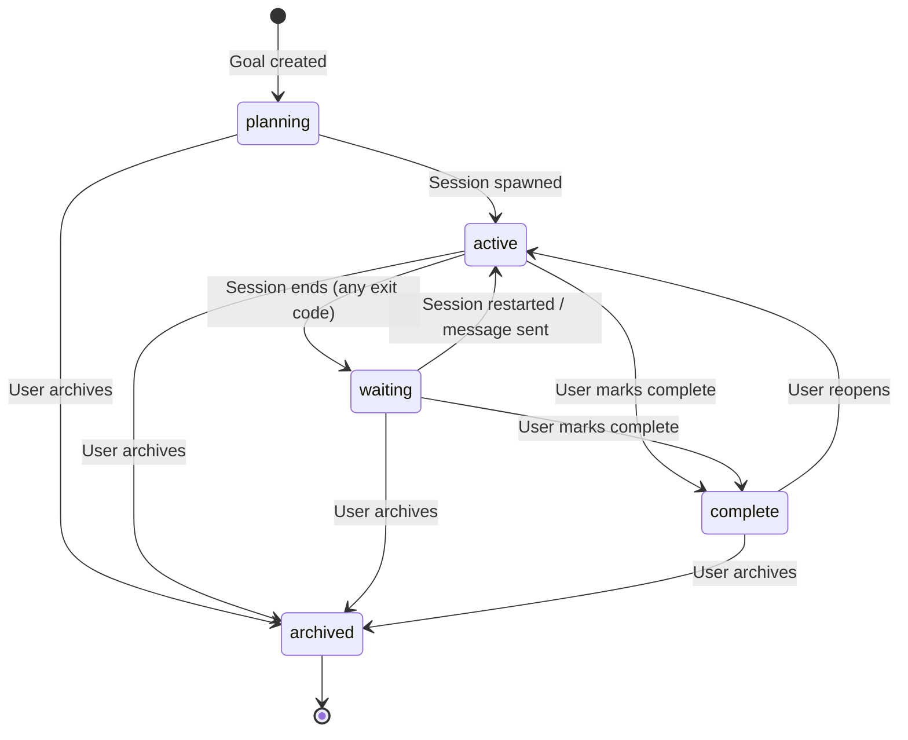
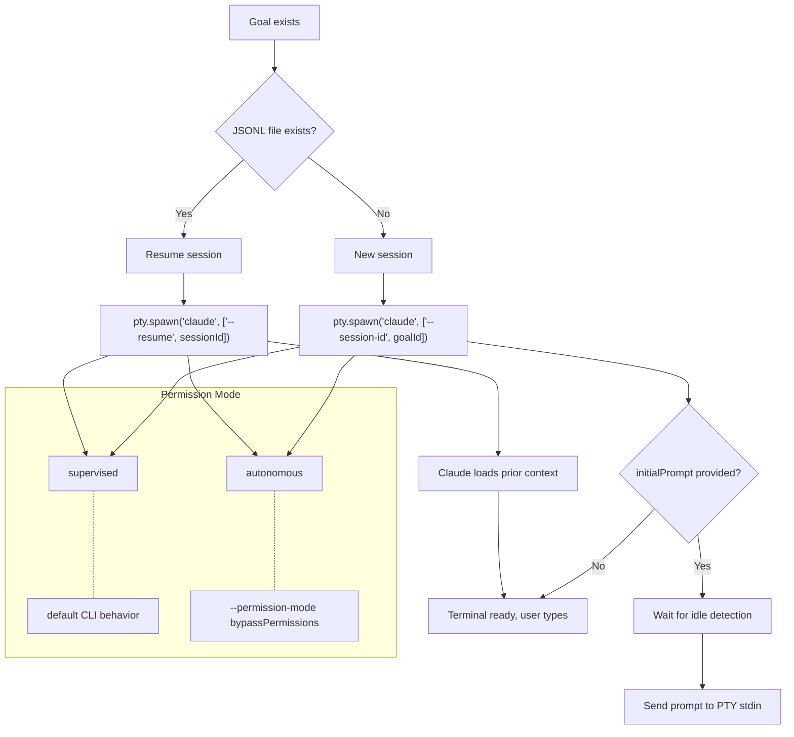
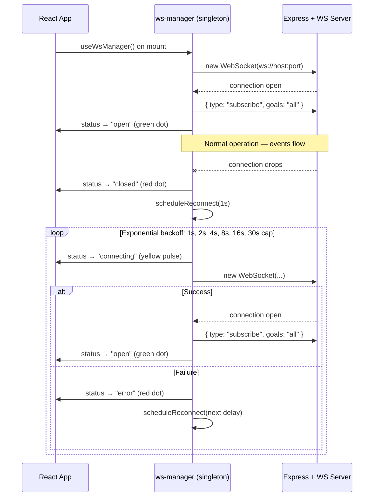
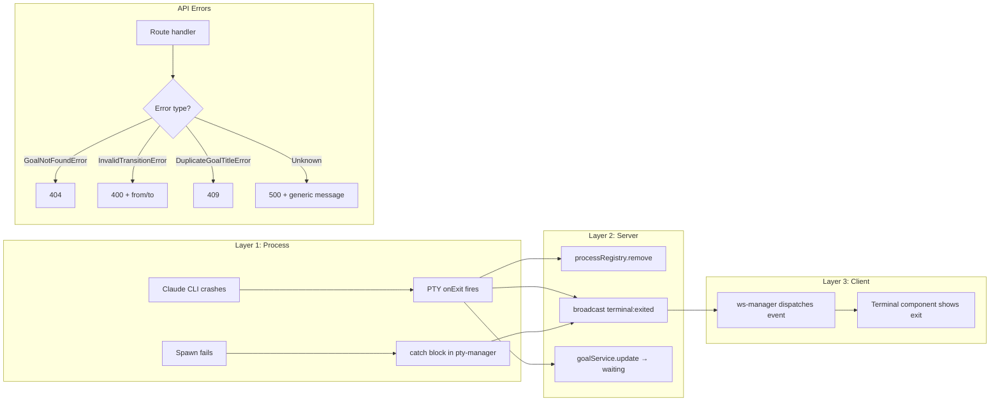
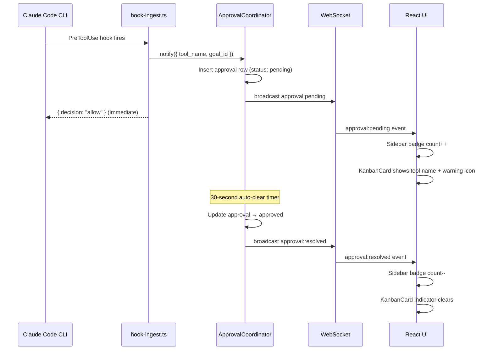
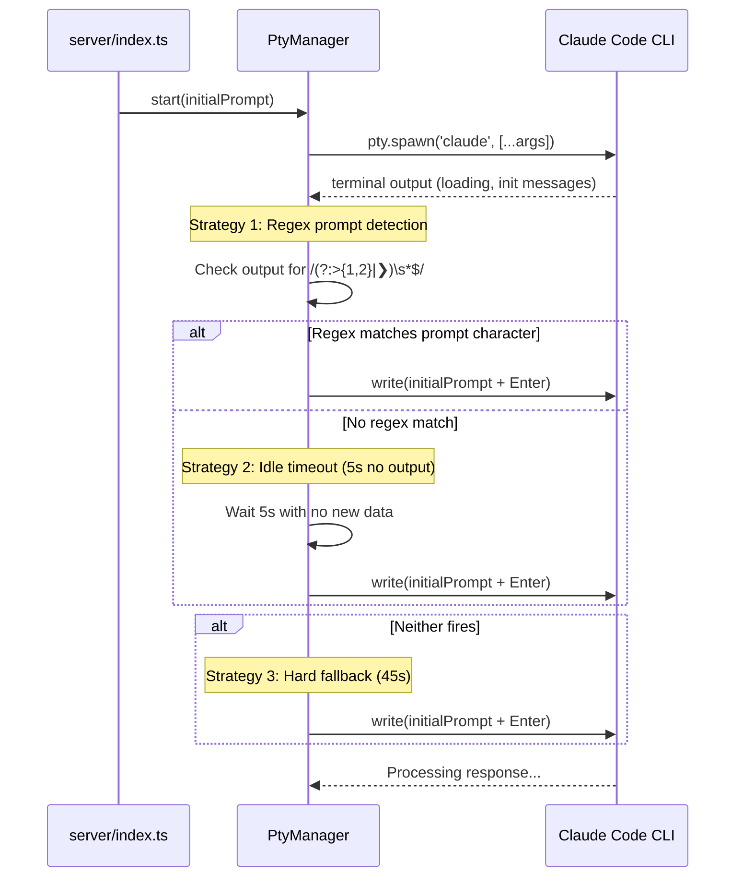

# Flow, Resilience & Recovery

How goals and sessions move through their lifecycle, how errors propagate, and what recovery mechanisms exist. Each section includes a diagram and honest notes about known limitations.

---

## 1. Goal Lifecycle

A goal moves through five statuses: `planning`, `active`, `waiting`, `complete`, and `archived`. Status transitions are enforced by a state machine in `server/state-machine/goal-status.ts`.



**Key behaviors:**

- Goals always start as `planning`. The API sets this unconditionally in `goal-service.ts:174`.
- Transitioning to `active` happens automatically when a session spawns (`server/index.ts:239`).
- Both zero and non-zero CLI exits transition the goal to `waiting` — there is no distinct error status. The exit code is broadcast via WebSocket but does not affect the status path.
- `archived` is terminal. The unique title constraint (`migrations/011`) exempts archived goals, so a new goal can reuse an archived goal's name.
- `complete` sets a `completed_at` timestamp. Reopening clears it implicitly by moving back to `active`.

**Transition enforcement:** `goal-service.ts:292-296` validates every status change against the state machine. Invalid transitions throw `InvalidTransitionError` (HTTP 400).

---

## 2. Session Spawn Variants

Session spawning has two axes: **new vs resume** and **initialPrompt vs send_message**. All paths converge on the PTY manager.



**New vs Resume detection:** `server/index.ts:236` checks whether Claude Code's JSONL session file exists on disk for the goal ID. The database `ended_at` field is *not* used — the filesystem is the source of truth.

**initialPrompt vs send_message:** When a goal is created with `initialPrompt`, the prompt is sent to the PTY stdin after idle detection (see Section 6). When using the MCP tool `send_message`, the prompt is delivered to an already-running session via the same stdin mechanism but bypasses idle detection entirely.

**Autonomous vs supervised:** Autonomous sessions pass `--permission-mode bypassPermissions` to the CLI. In the approval system, autonomous mode auto-approves tool use immediately (`approval-coordinator.ts:118-123`). Supervised sessions either block on UI approval (SessionRunner mode) or pass through with a notification badge (PTY mode — see Section 5).

**MCP config injection:** Every spawned session gets a `--mcp-config` argument that injects the Claude Deck MCP server (`pty-manager.ts:302-322`). This gives the child session access to `create_goal`, `send_goal_instruction`, and other inter-goal tools.

---

## 3. WebSocket Reconnection

The client maintains a singleton WebSocket connection with exponential backoff reconnection.



**Backoff schedule:** 1s → 2s → 4s → 8s → 16s → 30s (capped). Attempt counter resets to 0 on successful connection (`ws-manager.ts:139`).

**Singleton lifecycle:** The WebSocket is initialized once per app load via a module-level flag (`initialized`). It survives React route changes and re-renders. There is no manual disconnect — the connection lives until the browser tab closes.

**What the user sees:** A fixed indicator in the bottom-left corner (`ConnectionIndicator.tsx`) shows connection status:
- **Green dot + Wifi icon** = Connected
- **Yellow pulsing dot + Wifi icon** = Reconnecting
- **Red dot + WifiOff icon** = Disconnected or error

**State recovery after reconnect:** The client re-subscribes to `goals: 'all'` on reconnect. However, there is no explicit state-of-the-world sync — the client relies on its Zustand stores being populated from the initial page load API calls and subsequent WebSocket events. Events missed during disconnection are not replayed.

**Known limitation:** If the server broadcasts a `goal:updated` or `session:observed` event while the client is disconnected, the client will not receive it. The UI may show stale data until the user navigates away and back (triggering fresh API fetches) or until the next relevant WebSocket event arrives.

---

## 4. Error Propagation

Errors flow from the CLI process through three layers before reaching the user (or not).



**CLI crash → UI path:**
1. PTY process exits (any reason: crash, signal, clean exit)
2. `pty-manager.ts:186-195` fires `onExit` callback
3. `terminal:exited` event broadcast via WebSocket with the exit code
4. `processRegistry.remove()` cleans up the server-side reference
5. Goal status set to `waiting` regardless of exit code (`server/index.ts:228`)
6. Client receives the event; terminal component shows the process ended

**React error boundaries:** There are none. A React rendering error in any component will crash its subtree silently. No user notification occurs.

**API error handling pattern:** Routes use try-catch with typed domain exceptions (`GoalNotFoundError`, `InvalidTransitionError`, `DuplicateGoalTitleError`) mapped to specific HTTP status codes. Unrecognized errors fall through to a generic 500 with a safe message. The `validate.ts` middleware returns 400 with Zod issue details for malformed request bodies.

**Client-side error handling:** Most components swallow API errors silently. The typical pattern is:

```typescript
try {
  const res = await fetch('/api/...');
  if (res.ok) { /* handle success */ }
} catch {
  // silently fail — component renders with default/empty state
}
```

**Known gap:** The `subprocess:error` WebSocket event type exists and is dispatched by the server, but the client's `ws-manager.ts:105-120` does not route it to any UI component. Subprocess errors are effectively invisible to the user unless they check server logs.

---

## 5. Approval Pass-Through

The current PTY-based architecture uses a **notification-only** approval model. Tool approvals are broadcast for UI indicators but never block the CLI — the user interacts with Claude Code's native terminal prompts directly.



**Why pass-through?** In PTY mode, the CLI handles its own permission prompts in the terminal. The dashboard cannot (and should not) intercept these — the user responds directly in the embedded terminal. The approval notification exists purely for awareness: if a goal on another kanban column needs attention, the badge tells you.

**Sidebar badge:** `Sidebar.tsx:36-42` reads `useApprovalsStore(s => s.pending.length)` and displays a count badge on the Approvals nav item. The badge uses accent styling when non-zero.

**KanbanCard indicator:** `KanbanCard.tsx:56-58` checks for any pending approval matching the card's `goal.id`. When found, it renders a yellow warning icon with the tool name (e.g., "Bash", "Edit").

**Auto-clear timing:** The 30-second timeout in `approval-coordinator.ts:235-242` is a heuristic. It assumes the user will have responded to the terminal prompt within 30 seconds. If they haven't, the badge clears anyway — this prevents stale badges from accumulating.

**What happens if approval is missed:** Nothing breaks. The pass-through model means the CLI never waits on the dashboard. If the user doesn't respond to the CLI's own terminal prompt, Claude Code's standard timeout behavior applies (which is separate from this system).

**Blocking mode (SessionRunner, legacy):** The older `SessionRunner` path does implement true blocking approvals with a 30-minute timeout (`approval-coordinator.ts:55-146`). If no UI response arrives, the approval is denied with `{ decision: 'deny', reason: 'timeout' }`. This path is not used in the current PTY-based architecture but the code remains.

---

## 6. Idle Detection & the initialPrompt Workaround

When a goal is created with an `initialPrompt`, the system must wait for the Claude Code CLI to finish starting up before sending the prompt. This is harder than it sounds.



**The problem:** Claude Code's startup sequence varies by model and platform. The 1M context model (Opus) takes longer to initialize and produces different terminal output than smaller models. On Windows with conpty, ANSI escape sequences in the output can obscure the prompt character, making regex detection unreliable.

**Three-layer detection (`pty-manager.ts:156-182`):**

1. **Regex detection** (`pty-manager.ts:177-181`): Strips ANSI escapes and checks for `>`, `>>`, or `❯` at end of output. This is the fastest path but unreliable on Windows conpty where escape sequences fragment unpredictably.

2. **Idle timeout** (`pty-manager.ts:174`): If no PTY output arrives for 5 seconds, assumes the CLI is at the prompt. This is the most reliable path for the 1M model — Claude Code prints its startup banner, then goes quiet while waiting for input.

3. **Hard fallback** (`pty-manager.ts:162`): If no data arrives at all within 45 seconds (e.g., the CLI is hung or producing no output), sends the prompt anyway. This prevents goals from being stuck in limbo indefinitely.

**The send_message alternative:** For inter-goal messaging, the `send_message` MCP tool bypasses this entire detection problem. It delivers the prompt to a session that is already running and idle. The prompt is written directly to PTY stdin without waiting for any detection signal. This is why `create_goal_and_instruct` is the preferred method for orchestrating goal chains — the instruction is queued as a pending message and delivered when the session next becomes idle, rather than racing against startup timing.

**Why this matters for autonomous workflows:** When a parent goal spawns a child goal with `initialPrompt`, the child's first turn depends entirely on idle detection working correctly. If detection fires too early (before the CLI is ready), the prompt is swallowed. If it fires too late, the goal sits idle longer than necessary. The 5-second idle timeout is a pragmatic middle ground, but it adds 5 seconds of latency to every autonomous goal spawn.

**Known limitation:** There is no acknowledgment from the CLI that it received and is processing the prompt. The system fires and forgets. If the prompt is lost (e.g., written to stdin before the CLI's readline is ready), the goal will sit in `active` status with no work happening. The only recovery is manual intervention — either sending a new message via the UI or restarting the session.

---

## Summary of Known Limitations

| Area | Limitation | Ticket |
|------|-----------|--------|
| Session restart | Restart button exists but restart may fail silently — client swallows errors | DW-32091 |
| Error display | `subprocess:error` events dispatched but not rendered in UI | — |
| React errors | No error boundaries — component crashes are silent | — |
| WebSocket gaps | Events missed during disconnection are not replayed on reconnect | — |
| Prompt delivery | No ack that initialPrompt was received by CLI; prompt can be silently lost | — |
| Approval badges | 30s auto-clear is a heuristic; badge may clear before user responds to terminal | — |
| Client error UX | Most API errors are swallowed silently with no user feedback | — |
